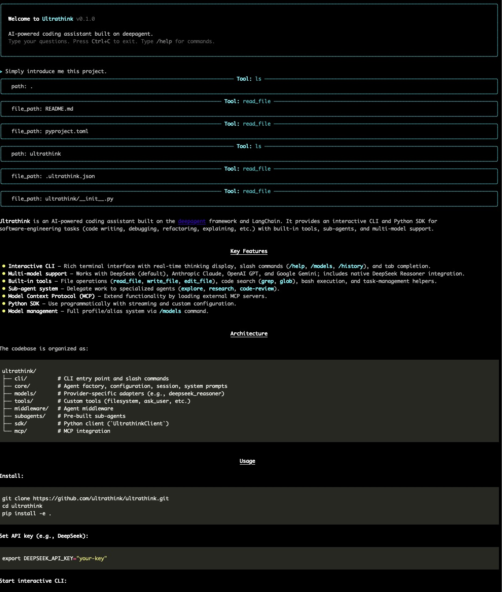
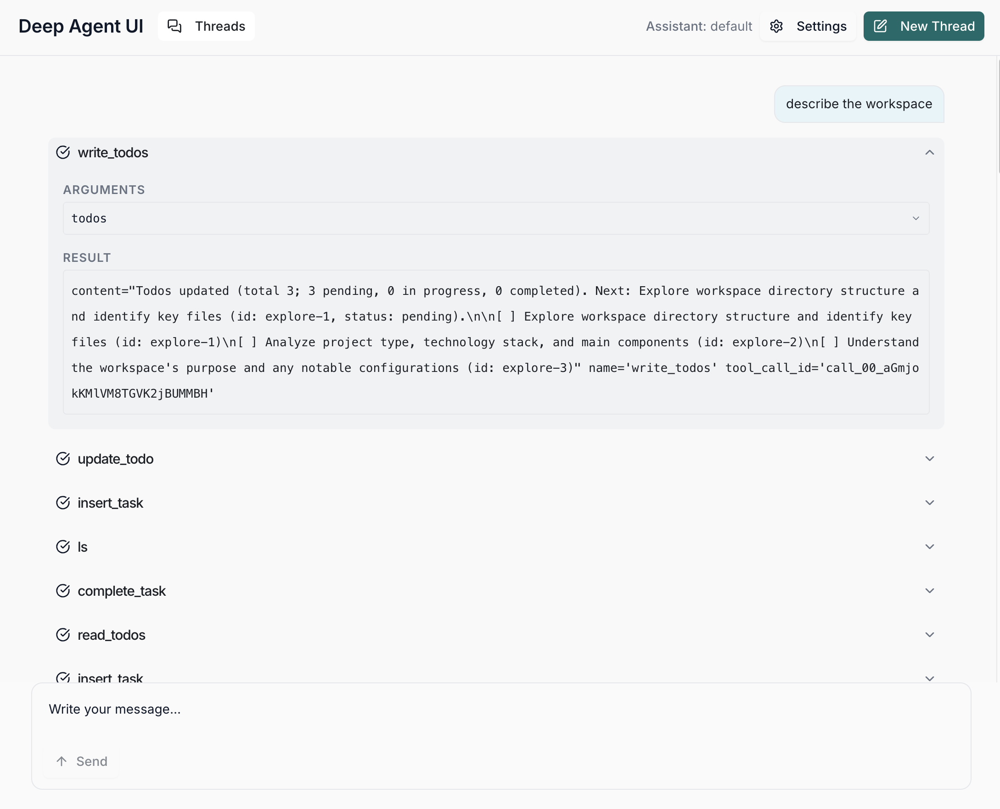

# Ultrathink

AI-powered coding assistant built on [deepagent](https://github.com/langchain-ai/deepagents) and [LangChain](https://github.com/langchain-ai/langchain).



---

> **Important Disclaimers**
>
> 1. **Origin**: This project was generated based on [ripperdoc](https://github.com/quantmew/ripperdoc) as a quick experiment with the LangChain/deepagent framework.
>
> 2. **Experimental Only**: This is purely an experimental project for exploring ideas. **No special consideration has been given to permission restrictions or security protections.** Use or modify at your own risk. For production use, please consider [Claude Code](https://docs.anthropic.com/en/docs/claude-code) or [ripperdoc](https://github.com/quantmew/ripperdoc).
>
> 3. **Default API**: This project uses **DeepSeek** as the default API provider.

---

## Features

### Core Capabilities

- **Interactive CLI** - Rich terminal interface with real-time thinking process display
- **Multi-model Support** - Works with DeepSeek, Anthropic Claude, OpenAI GPT, and Google Gemini
- **DeepSeek Reasoner** - Native support for DeepSeek Reasoner with thinking chain display
- **Built-in Tools** - File operations, code search, bash execution, task management
- **Subagent System** - Delegate tasks to specialized agents (explore, research, code-review)
- **MCP Integration** - Extend functionality with Model Context Protocol servers
- **Python SDK** - Use programmatically in your applications

### Web UI

Modern web interface compatible with LangGraph SDK, providing a visual chat experience.



**Features:**
- Real-time streaming responses with Server-Sent Events (SSE)
- Thread management with conversation history
- Clean, responsive design built with Next.js and Tailwind CSS

**Quick Start:**
```bash
ultrathink serve              # Start at http://localhost:8000
ultrathink serve --port 3000  # Custom port
ultrathink serve --no-frontend  # API only mode
```

### CLI Features

- **Slash Commands** - `/help`, `/clear`, `/models`, `/stats`, `/history`, `/compact`
- **Command Autocomplete** - Tab completion for slash commands and subcommands
- **Model Management** - `/models` command for managing model profiles and aliases
- **Conversation History** - Persistent history with file-based storage
- **Thinking Display** - Visual spinner and content display for reasoning models

### Model Management (`/models`)

Full-featured model profile and alias management:

```bash
/models list              # List all profiles and aliases
/models add <name> <provider:model> [--api-key KEY] [--base-url URL]
/models update <name> [--api-key KEY] [--base-url URL] [--model MODEL]
/models remove <name>     # Remove a profile
/models alias <alias> <profile>    # Create custom alias
/models unalias <alias>   # Remove custom alias
/models use <name>        # Set as main model
```

Supported providers: `deepseek`, `anthropic`, `openai`, `gemini`

### Built-in Subagents

| Agent | Description |
|-------|-------------|
| `explore` | Fast codebase exploration and file search |
| `research` | Deep research with comprehensive analysis |
| `code-review` | Code review and quality analysis |
| `refactor` | Code restructuring and architecture improvements |
| `test` | Writing and analyzing tests |

Use `/agents` command to see all available agents including custom ones.

## Installation

```bash
# Clone the repository
git clone https://github.com/ultrathink/ultrathink.git
cd ultrathink
pip install -e .
```

## Quick Start

### Environment Setup

Set your API key (DeepSeek by default):

```bash
export DEEPSEEK_API_KEY="your-key-here"
```

Or use other providers:

```bash
export ANTHROPIC_API_KEY="your-key-here"
export OPENAI_API_KEY="your-key-here"
export GEMINI_API_KEY="your-key-here"
```

Or configure via `/models` command in interactive mode.

### CLI Mode

```bash
# Start interactive mode
ultrathink

# Or use the short alias
ut

# Execute a single command
ultrathink -p "Explain this codebase"

# Use a specific model
ultrathink --model deepseek:deepseek-reasoner
ultrathink --model anthropic:claude-sonnet-4-20250514
```

### Slash Commands

In interactive mode:

| Command | Description |
|---------|-------------|
| `/help` | Show available commands |
| `/clear` | Clear conversation history |
| `/models` | Manage model profiles and aliases |
| `/agents` | List available subagents |
| `/history` | Show conversation history |
| `/stats` | Show session statistics |
| `/compact` | Compact conversation history |
| `/exit` | Exit the application |

### Python SDK

```python
import asyncio
from ultrathink import UltrathinkClient

async def main():
    async with UltrathinkClient() as client:
        result = await client.query("Explain this function")
        print(result.content)

asyncio.run(main())
```

#### Streaming Responses

```python
async def stream_example():
    async with UltrathinkClient() as client:
        async for chunk in client.stream("Write a hello world function"):
            print(chunk, end="", flush=True)
```

#### Custom Configuration

```python
from ultrathink.sdk.client import UltrathinkClient, UltrathinkOptions

options = UltrathinkOptions(
    model="deepseek:deepseek-reasoner",
    safe_mode=True,
    verbose=False,
)

async with UltrathinkClient(options) as client:
    result = await client.query("Your prompt here")
```

## Configuration

### Global Configuration

Located at `~/.ultrathink.json`:

```json
{
  "model_profiles": {
    "default": {
      "provider": "deepseek",
      "model": "deepseek-reasoner",
      "api_base": "https://api.deepseek.com/v1",
      "api_key": "sk-xxx"
    }
  },
  "model_pointers": {
    "main": "default",
    "task": "default",
    "quick": "default",
    "custom": {}
  },
  "has_completed_onboarding": true
}
```

### Model Aliases

- **Built-in aliases**: `main`, `task`, `quick` (always point to a profile)
- **Custom aliases**: User-defined aliases for use in subagents or tools

```bash
/models alias my-fast default    # Create custom alias
/models unalias my-fast          # Remove custom alias
```

### MCP Integration

Ultrathink supports [Model Context Protocol](https://modelcontextprotocol.io/) servers.

Create `mcp_config.json` in your project:

```json
{
  "mcpServers": {
    "my-server": {
      "command": "npx",
      "args": ["-y", "@my/mcp-server"]
    }
  }
}
```

MCP tools will be automatically loaded and available to the agent.

## Custom Subagents

Create custom subagents in `~/.ultrathink/agents/` or `.ultrathink/agents/`:

```yaml
# my-agent.yaml
name: my-agent
description: Custom agent for specific tasks
tools:
  - read_file
  - write_file
  - grep
system_prompt: |
  You are a specialized agent for...
```

Or use Markdown with frontmatter:

```markdown
---
name: my-agent
description: Custom agent for specific tasks
tools:
  - read_file
  - write_file
---

You are a specialized agent for...
```

## Project Structure

```
ultrathink/
├── api/                     # Web API (FastAPI)
│   ├── app.py               # FastAPI application
│   ├── routes/              # API endpoints
│   └── services/            # Business logic
├── cli/
│   ├── main.py              # CLI entry point
│   ├── commands/            # Slash commands
│   └── ui/
│       ├── rich_console.py  # Rich interactive interface
│       └── thinking_spinner.py
├── core/
│   ├── agent_factory.py     # Agent creation
│   ├── config.py            # Configuration management
│   ├── session.py           # Session state
│   └── system_prompt.py     # System prompts
├── models/
│   └── deepseek_reasoner.py # DeepSeek Reasoner support
├── tools/                   # Custom tools
│   ├── filesystem.py
│   └── ask_user.py
├── middleware/              # Agent middleware
├── sdk/
│   └── client.py            # Python SDK
└── web/                     # Web UI (Next.js)
    ├── src/                 # React components
    ├── public/              # Static assets
    └── out/                 # Built frontend (auto-generated)
```

## Development

```bash
# Install with dev dependencies
pip install -e ".[dev]"

# Run tests
pytest

# Run linter
ruff check .

# Run type checker
mypy ultrathink
```

## License

Apache 2.0

## Acknowledgments

- [ripperdoc](https://github.com/quantmew/ripperdoc) - Original inspiration and reference implementation
- [deepagent](https://github.com/langchain-ai/deepagents) - Agent framework
- [LangChain](https://github.com/langchain-ai/langchain) - LLM application framework
